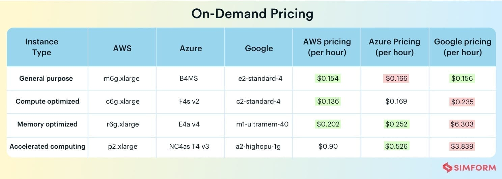

# Ønsker til løsningen
* Skal være kombatibel med vores app produkt
* Skal være nemt at upload og opdatere
* Mulighed for support på dagen hvor eventet kører
* Prisen for trafik og service
* Skalerbar - så automatisk som muligt
* Kan lukkes efter en valgt periode

# Forslag til udbydere
## De tre store
### Amazon AWS
Link til service: https://aws.amazon.com/free/

### Google Cloud
Link til service: https://cloud.google.com/

### Microsoft Azure - ScanNet

## Pris sammenligning mellem cloud løsninger

## Andre udbydere
### Heroku
#### Fordele
* Integrerer sig med GitHub, se evt. https://www.heroku.com/dx
* Kan benytte CI/CD på GitHub til at validere og deplay med preview app
* Skalérer hurtigt alt efter behov

#### Ulemper
* PostgresSQL istedet for MySQL
* Kan være svært at se prosen for ydelsen

### Digital Ocean
Slår sig frem på at skulle være simplere end eks. Google Cloud og AWS. 
De sælger sig selv på at være 18% billigere end Google Cloud.

#### Fordele
* Man får 100$ i start kredit, som man kan bruge i sin udvikling
* 

### ScanNet

Link til service: https://www.scannet.dk/cloud-server/?gclid=Cj0KCQiAkZKNBhDiARIsAPsk0WgZgMNsszdXXmPLHT71NdG1W-P--srxxQBn5fInzI6tdqWMAUHN2l8aAi5pEALw_wcB

### Cloudservice.dk
Cloudservers holder til i Aarhus.
Med base i centrum af Aarhus har vi siden 1998 været førende indenfor Cloudhosting.

Cloudservers A/S
Åbogade 15
8200 Aarhus N
CVR: 26616409

Link til service: https://cloudservers.dk/
